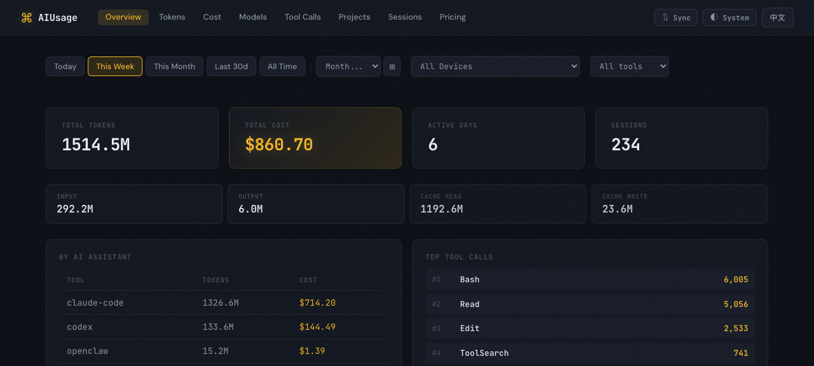

# aiusage

在一个地方追踪 Claude Code、Codex、OpenClaw、OpenCode 的 AI 编程助手使用情况，包括 token 消耗、费用和工具调用。

[English](./README.md) | 中文

## 为什么使用 aiusage

- 将多个 AI 编程助手的本地会话日志汇总到同一个视图中。
- 分析 token 用量、费用、模型分布和工具调用活跃度。
- 通过本地 Web 仪表盘查看按周、按月的趋势和汇总。
- 通过 GitHub、S3 或 R2 在多台设备之间同步数据。
- 默认本地优先，只有在需要共享视图时才启用云同步。

## 快速开始

**前置条件：** Node.js >= 18

```bash
# 安装
npm install -g @juliantanx/aiusage

# 解析本地会话日志
aiusage parse

# 启动仪表盘
aiusage serve
# 打开 http://localhost:3847
```

日常使用通常只需要：

```bash
aiusage parse
aiusage serve
```

`aiusage` 不会内建后台解析任务。如果你需要自动导入，请使用 cron 或任务计划定时执行 `aiusage parse`。

<details>
<summary>从源码构建</summary>

```bash
git clone https://github.com/juliantanx/aiusage.git
cd aiusage
pnpm install
pnpm build
cd packages/cli
npm link
```

</details>

## 截图



按“本周”筛选后的概览页，展示费用、token、活跃天数和工具使用分布。

## 常用命令

| 命令 | 用途 |
| --- | --- |
| `aiusage parse` | 导入本地新追加的会话数据 |
| `aiusage serve` | 启动本地仪表盘 |
| `aiusage summary` | 在终端输出用量摘要 |
| `aiusage status` | 显示数据库路径、schema 版本和记录数 |
| `aiusage sync` | 与已配置的远程后端双向同步数据 |
| `aiusage export` | 导出 CSV、JSON 或 NDJSON 数据 |
| `aiusage clean` | 清理旧数据 |
| `aiusage recalc` | 按最新定价重新计算费用 |
| `aiusage init` | 配置同步后端 |

## Web 仪表盘

```bash
aiusage serve
# 打开 http://localhost:3847
```

概览页首次加载时会调用 `/api/refresh`，先执行一次本地增量 parse，再加载统计数据。

- **概览** — 按周或按月查看总量、费用、活跃天数和按工具分组的汇总。
- **Token** — token 用量随时间的变化趋势。
- **费用** — 费用趋势，以及按工具、按模型拆分的统计。
- **模型** — 模型占比和分布。
- **工具调用** — 工具调用频率和排行。
- **Projects** — 按项目汇总的使用数据。
- **会话** — 支持筛选和分页的会话浏览。
- **Pricing** — 当前模型定价参考。

---

## 部署

如果你需要多机汇总或云端访问，可以按场景选择：

| 场景 | 方式 | 说明 |
|------|------|------|
| 多台机器汇总数据 | [多机同步](#多机同步) | 通过 GitHub / S3 / R2 同步 |
| 多台机器 + 统一看板 | [Docker 部署](#docker-部署) | 基于同步数据运行 24/7 仪表盘 |

如果只是单机使用，按照上面的快速开始即可。

### 多机同步

适合把多台机器上的 Claude Code、Codex、OpenClaw、OpenCode 使用数据聚合到同一个仪表盘中。

**架构：**

```
机器 A ──┐
机器 B ──┼──▶ GitHub / S3 / R2（共享存储）──▶ 任意机器：aiusage summary / serve
机器 C ──┘
```

**第一步 — 选择同步后端**

**方案 A：GitHub（推荐）**

1. 在 GitHub 上创建一个**私有**仓库（例如 `aiusage-data`）
2. 生成 [Personal Access Token](https://github.com/settings/tokens) 并授予 `repo` 权限

**方案 B：AWS S3 / Cloudflare R2**

1. 创建一个 S3 或 R2 bucket
2. 创建具备读写权限的 IAM 用户或角色
3. 记录 access key ID、secret access key 和 endpoint

**第二步 — 在每台机器上安装并配置**

在每一台使用 Claude Code、Codex、OpenClaw 或 OpenCode 的机器上执行：

```bash
# 安装 aiusage CLI
npm install -g @juliantanx/aiusage

# 配置同步后端 — GitHub
aiusage init --backend github \
  --repo <user>/aiusage-data \
  --token ghp_xxxxxxxxxxxxxxxxxxxx

# 或配置同步后端 — S3 / R2
aiusage init --backend s3 \
  --bucket my-aiusage-bucket \
  --prefix aiusage/ \
  --endpoint https://<account-id>.r2.cloudflarestorage.com \
  --region auto \
  --access-key-id AKIAxxxxxxxxxxxx \
  --secret-access-key xxxxxxxxxxxxxxxxxxxxxxxxxx
```

**第三步 — 在每台机器上解析并同步**

```bash
aiusage parse
aiusage sync
```

**第四步 — 在任意机器上查看汇总数据**

```bash
aiusage sync
aiusage summary
aiusage serve
```

**自动化（推荐）**

```bash
# Linux/macOS
crontab -e
# 添加：
*/30 * * * * /usr/local/bin/aiusage parse && /usr/local/bin/aiusage sync >> ~/.aiusage/cron.log 2>&1

# Windows
schtasks /create /tn "AiusageSync" /tr "aiusage parse && aiusage sync" /sc minute /mo 30
```

**同步原理**

- 每台机器在首次运行时都会生成唯一的 `deviceInstanceId`。
- 每台设备都会向远端后端写入自己的按日文件（`{deviceInstanceId}/YYYY/MM/DD.ndjson`）。
- Pull 会把其他设备的文件读入本地 `synced_records` 表；upload 只写当前设备自己的文件。
- 按设备拆分文件可避免写冲突，因此不需要加锁。
- 同步频率由外部定时任务或手动执行决定；aiusage 不内建常驻同步进程。
- Session ID 会通过 `sha256(device + sessionId)` 匿名化。

---

### Docker 部署

你可以在服务器上运行预构建镜像，提供 24/7 仪表盘。容器本身**不会**运行任何 AI 编程工具，它只负责提供 Web 仪表盘，并从 GitHub、S3 或 R2 拉取同步数据。

**架构：**

```
机器 A ──┐                             ┌── 浏览器：https://aiusage.your-domain.com
机器 B ──┼──▶ GitHub / S3 / R2 ──▶ 云端服务器（Docker）
机器 C ──┘                             └── 端口 3847
```

**数据流向**

1. 每台开发机器运行 `aiusage parse && aiusage sync` 上传本地用量数据。
2. Docker 容器运行 `aiusage sync` 将远端数据拉取到本地 SQLite 数据库。
3. Web 仪表盘读取本地数据库并展示聚合统计。

**Docker 中的数据存储**

| 项目 | 容器内路径 | 说明 |
|------|-----------|------|
| 数据库 | `/root/.aiusage/cache.db` | 存放聚合用量数据的 SQLite 数据库 |
| 配置文件 | `/root/.aiusage/config.json` | 同步后端配置和凭证 |
| 状态文件 | `/root/.aiusage/state.json` | 水位线和同步状态 |

所有数据都位于 `/root/.aiusage` 下，并被声明为 `VOLUME`。你**必须**挂载 volume，才能在容器重启后保留数据。

**第一步 — 拉取镜像并运行**

```bash
# 拉取镜像
docker pull juliantanx/aiusage

# 运行容器（挂载 volume 持久化数据）
docker run -d \
  --name aiusage \
  -p 3847:3847 \
  -v aiusage-data:/root/.aiusage \
  juliantanx/aiusage

# 配置同步后端
docker exec -it aiusage aiusage init \
  --backend github \
  --repo <user>/aiusage-data \
  --token ghp_xxxxxxxxxxxxxxxxxxxx

# 首次拉取数据
docker exec -it aiusage aiusage sync
```

> 如果不加 `-v` 参数，删除容器后数据会丢失。

**第二步 — 定时同步**

```bash
# 在容器内安装 cron 并创建定时任务
docker exec -it aiusage bash -c "apt-get update && apt-get install -y cron"
docker exec -it aiusage bash -c \
  'echo "*/30 * * * * aiusage sync >> /root/.aiusage/cron.log 2>&1" | crontab -'
docker restart aiusage
```

> 注意：这里不需要 `parse`，因为容器内没有本地 AI 会话日志，只需要 `sync` 从远端拉取数据。

**第三步 — 访问**

打开 `http://<服务器IP>:3847`。

如果你需要 HTTPS + 自定义域名：

```bash
# Caddy（自动 HTTPS，推荐）
caddy reverse-proxy --from aiusage.your-domain.com --to localhost:3847

# 或 Nginx
server {
    listen 80;
    server_name aiusage.your-domain.com;
    location / {
        proxy_pass http://127.0.0.1:3847;
        proxy_set_header Host $host;
        proxy_set_header X-Real-IP $remote_addr;
    }
}
```

**自行构建镜像（可选）**

项目根目录已经包含 `Dockerfile`：

```bash
docker build -t aiusage .
```

---

## 数据存储

| 项目 | 路径 |
|------|------|
| 本地数据库 | `~/.aiusage/cache.db` |
| 配置文件 | `~/.aiusage/config.json` |
| 状态文件（水位线、同步状态） | `~/.aiusage/state.json` |

### 默认日志来源路径

`aiusage parse` 会自动从以下默认位置发现会话日志：

| 工具 | macOS | Linux | Windows |
|------|-------|-------|---------|
| Claude Code | `~/.claude/projects/` | `~/.claude/projects/` | `%USERPROFILE%\.claude\projects\` |
| Codex | `~/.codex/sessions/` | `~/.codex/sessions/` | `%USERPROFILE%\.codex\sessions\` |
| OpenClaw | `~/.openclaw/agents/*/sessions/` | `~/.openclaw/agents/*/sessions/` | `%USERPROFILE%\.openclaw\agents\*\sessions\` |
| OpenCode | `~/Library/Application Support/opencode/opencode.db` | `~/.local/share/opencode/opencode.db` | `%APPDATA%\opencode\opencode.db` |

> 在 Linux 上，如果设置了 `$XDG_DATA_HOME`，OpenCode 会优先使用它。

### 自定义来源路径

如果某个工具安装在非默认位置，可以在 `~/.aiusage/config.json` 中覆盖路径：

```json
{
  "sources": {
    "claude-code": "/自定义路径/.claude/projects",
    "codex": "/自定义路径/.codex/sessions",
    "openclaw": "/自定义/sessions目录",
    "opencode": "/自定义路径/opencode.db"
  }
}
```

只有你显式指定的工具路径会被覆盖；未指定的仍使用默认路径。

## 数据库可视化查看

本地数据库是标准 SQLite 文件，因此可以直接用 DBeaver、TablePlus、DataGrip、DB Browser for SQLite 等工具打开。

```bash
aiusage status
# 显示精确的 DB Path、schema 版本和对象数量
```

- 以 SQLite 数据库方式打开 `~/.aiusage/cache.db`。
- 推荐在数据库工具中使用只读模式；`aiusage` 会持续写入同一个文件，并启用了 WAL 模式。
- 如果工具提示关联文件，请保留 `cache.db-wal` 和 `cache.db-shm` 与主库同目录。
- 优先查看这些只读视图：
  - `v_usage_records`：每条 usage 记录一行，包含标准化时间和总 token
  - `v_tool_calls`：工具调用明细，并关联所属 usage 记录
  - `v_sessions`：按会话聚合后的统计，便于透视和图表分析
- 如需排查底层数据，也可以查看原始表：
  - `records`
  - `tool_calls`
  - `synced_records`
  - `sync_tombstones`

## 技术栈

- **运行时：** Node.js、TypeScript
- **数据库：** better-sqlite3（本地，WAL 模式）
- **CLI：** Commander.js
- **Web：** SvelteKit + adapter-static
- **构建：** tsup（core/cli）、Vite（web）
- **同步：** GitHub API、AWS S3 / Cloudflare R2

## 项目结构

```text
packages/
  core/     - 共享类型、数据库 schema、定价数据
  cli/      - CLI 工具，用于解析日志、查询数据、云端同步
  web/      - SvelteKit Web 仪表盘（SPA）
```

## 许可证

MIT
